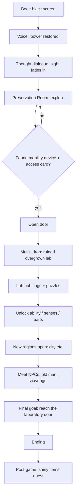
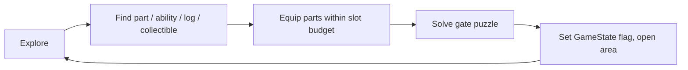
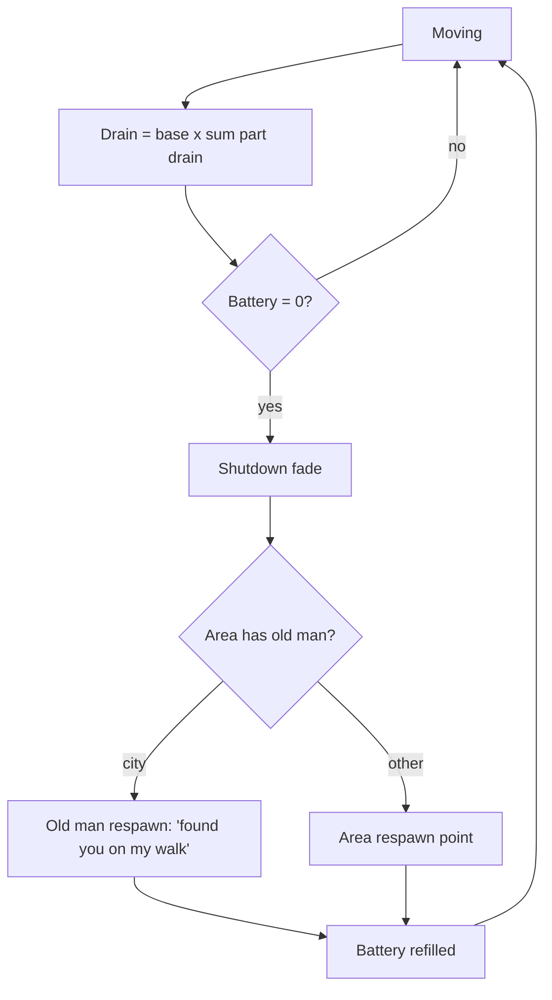
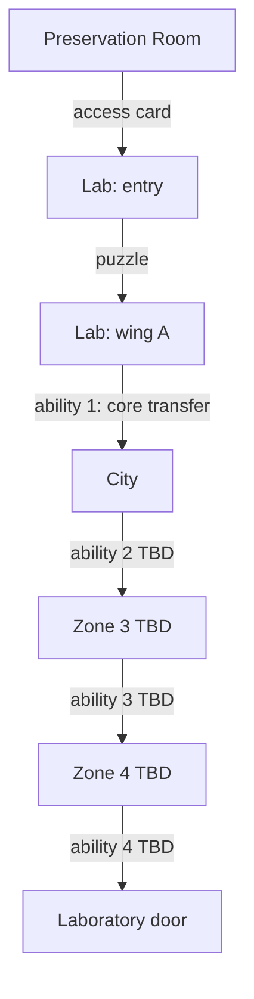
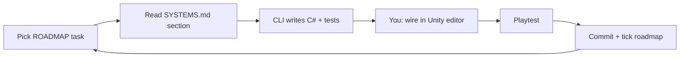

# Game Flow

## 1. Player journey

```mermaid
flowchart TD
  A[Boot: black screen] --> B["Voice: 'power restored'"]
  B --> C[Thought dialogue, sight fades in]
  C --> D[Preservation Room: explore]
  D --> E{Found mobility device + access card?}
  E -- no --> D
  E -- yes --> F[Open door]
  F --> G[Music drop: ruined overgrown lab]
  G --> H[Lab hub: logs + puzzles]
  H --> I[Unlock ability / senses / parts]
  I --> J[New regions open: city etc.]
  J --> K[Meet NPCs: old man, scavenger]
  K --> L[Final goal: reach the laboratory door]
  L --> M[Ending]
  M --> N[Post-game: shiny items quest]
```

## 2. Moment-to-moment loop

```mermaid
flowchart LR
  Explore --> Find[Find part / ability / log / collectible]
  Find --> Customize[Equip parts within slot budget]
  Customize --> Puzzle[Solve gate puzzle]
  Puzzle --> Unlock[Set GameState flag, open area]
  Unlock --> Explore
```

## 3. Battery / respawn

```mermaid
flowchart TD
  M[Moving] --> D[Drain = base x sum part drain]
  D --> Z{Battery = 0?}
  Z -- no --> M
  Z -- yes --> S[Shutdown fade]
  S --> R{Area has old man?}
  R -- city --> O["Old man respawn: 'found you on my walk'"]
  R -- other --> P[Area respawn point]
  O --> F[Battery refilled]
  P --> F
  F --> M
```

## 4. Progression gate graph (fill as areas are designed)

```mermaid
flowchart TD
  Room[Preservation Room] -->|access card| Lab1[Lab: entry]
  Lab1 -->|puzzle| Lab2[Lab: wing A]
  Lab2 -->|ability 1: core transfer| City[City]
  City -->|ability 2 TBD| Zone3[Zone 3 TBD]
  Zone3 -->|ability 3 TBD| Zone4[Zone 4 TBD]
  Zone4 -->|ability 4 TBD| LabDoor[Laboratory door]
```

## 5. Dev workflow (CLI)

```mermaid
flowchart LR
  Roadmap[Pick ROADMAP task] --> Spec[Read SYSTEMS.md section]
  Spec --> Code[CLI writes C# + tests]
  Code --> Manual[You: wire in Unity editor]
  Manual --> Play[Playtest]
  Play --> Commit[Commit + tick roadmap]
  Commit --> Roadmap
```
